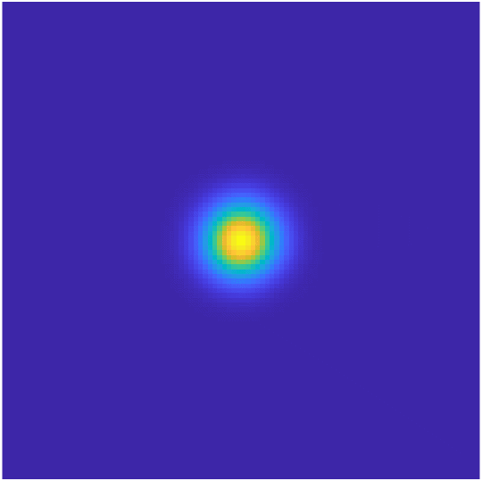
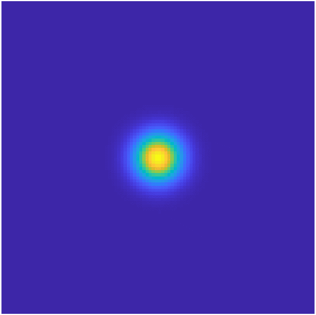
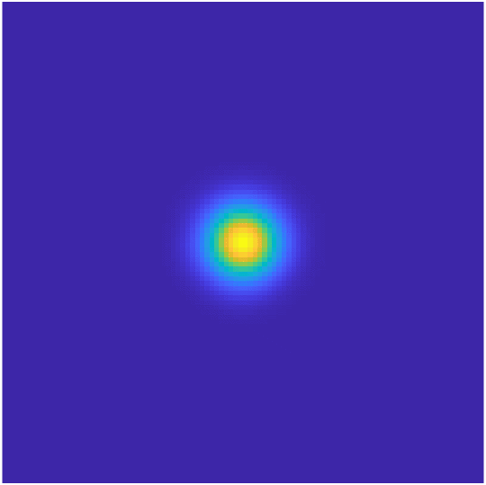
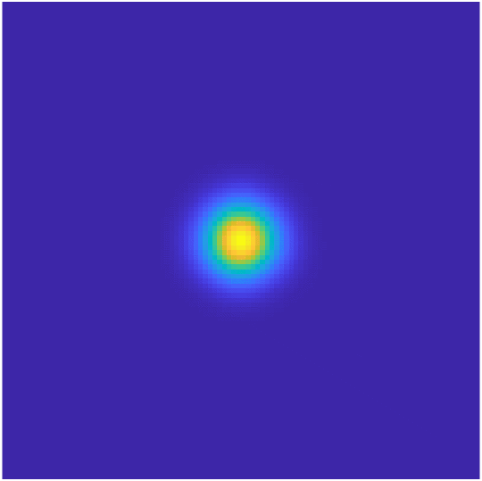
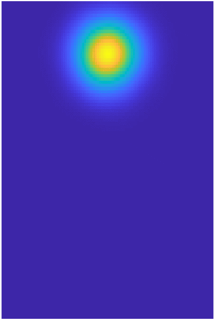
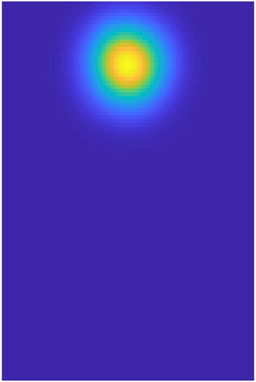
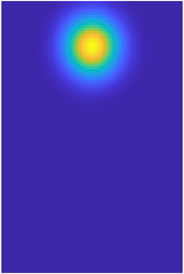
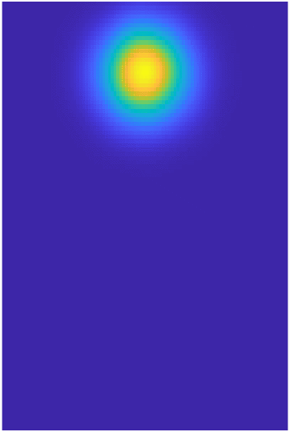

# Trajectory-regularized Normalizing Flows (NF) and Mean Field Games (MFG)

The official repository for the code and experiments used in the work:

> Huang, Han, et al. "Bridging Mean-Field Games and Normalizing Flows with Trajectory Regularization." arXiv preprint arXiv:2206.14990 (2022).
> [[arXiv]](https://arxiv.org/abs/2206.14990)


## Results

### Using NF to solve high-dimensional MFG

#### Gaussian Mixture

| 2D  | 10D | 50D | 100D |
| ------------- | ------------- | ------------- | ------------- |
|   |   |   |   |


#### Crowd Motion

| 2D  | 10D | 50D | 100D |
| ------------- | ------------- | ------------- | ------------- |
|   |   |   |   |

10D, with various obstacle avoidance behaviors:

| Weak | Moderate | Strong |
| ------------- | ------------- | ------------- |
|   |   |   |


### Multi-Group Interactions


### Using MFG transport cost to regularize NF


### Robot Motion Planning


## Dependencies

The implementation of Neural Spline Flow (NSF) as well as the associated density experiments are adapted from the original repository: https://github.com/bayesiains/nsf

Tested with Python 3.6 and PyTorch 1.6

## Data

Data for density-estimation experiments is available at https://zenodo.org/record/1161203#.Wmtf_XVl8eN.


## Experiments

One can run the expriments shown in the paper by calling `python mfg.py` with different arguments. Each run creates a directory at `./results/<dataset name>/<experiment name>` to store all the relevant information for plotting, etc.

### Using NF to solve high-dimensional MFG

#### Gaussian Mixture
To run the experiment in 100D, do:

```
python mfg.py --exp_name 100D --linear_transform_type lu_no_perm --reg_OT_dir gen --num_training_steps 100000 --base_transform_type rq-coupling --tail_bound 5 --OT_part block_CL_no_perm --lbd_OT 2e-1 --gaussian_multi_dim 100 --num_train_data 5000000 --LU_last false --NF_loss jeffery --lr_schedule adaptive --train_batch_size 2048 --learning_rate 1e-3
```

The same experiment in a different dimension can be done with the same setting, only changing `--gaussian_dim` from 100 to the desired one.
    - Note: the model converges faster in lower dimensions, e.g., 2D takes about 20k iterations. 


#### Crowd Motion
To run the experiment in 100D, do:

```
python mfg.py --exp_name 100D --disc_scheme FD4_simp --reg_OT_dir gen --linear_transform_type lu_no_perm --LU_last false --NF_loss jeffery --lr_schedule adaptive --dataset_name crowd_motion_gaussian --num_training_steps 100000 --base_transform_type rq-coupling --gaussian_multi_dim 100 --num_train_data 10000000 --OT_part block_CL_no_perm --lbd_OT 1e-1 --lbd_F 2e-1 --train_batch_size 2048 --learning_rate 1e-3 --tail_bound 5 
```

The same experiment in a different dimension can be done with the same setting, only changing `--gaussian_dim` from 100 to the desired one. Again, the model converges faster in lower dimensions so one could use a smaller `--num_training_steps`.

One can experiment with different weights on the MFG costs (`--lbd_OT, --lbd_F`) and observe how the learned trajectory changes. For example, a bigger `--lbd_F` incentivizes the agents to avoid the obstacles more.


#### Multi-Group, 2 populations

To run the 2D experiment with strong avoidance behavior, do:

```
python multi_mfg.py --exp_name strong_avoid --reg_OT_dir gen --linear_transform_type lu_no_perm --dataset_name drones_22 --num_training_steps 50000 --base_transform_type rq-coupling --gaussian_multi_dim 2 --OT_part block_CL_no_perm --lbd_OT 2e-1 --lbd_F 5e0 --LU_last false --train_batch_size 256 --tail_bound 3 --num_flow_steps 10 --num_train_data 100000 --disc_scheme FD4_simp --NF_loss jeffery --lr_schedule adaptive 
```

To run the 3D experiment with strong avoidance behavior, do:

```
python multi_mfg.py --exp_name strong_avoid --reg_OT_dir gen --linear_transform_type lu_no_perm --dataset_name drones_23 --num_training_steps 50000 --base_transform_type rq-coupling --gaussian_multi_dim 2 --OT_part block_CL_no_perm --lbd_OT 2e-1 --lbd_F 5e0 --LU_last false --train_batch_size 256 --tail_bound 3 --num_flow_steps 10 --num_train_data 200000 --disc_scheme FD4_simp --NF_loss jeffery --lr_schedule adaptive 
```


For other levels of avoidance behavior in both 2D and 3D, change `--lbd_F`.


#### Multi-Group, 8 populations

To run the experiment with strong avoidance behavior, do:

```
python multi_mfg.py --exp_name strong_avoid --radius_82 2 --var_drones 5e-3 --reg_OT_dir gen --linear_transform_type lu_no_perm --dataset_name drones_82 --num_training_steps 50000 --base_transform_type rq-coupling --OT_part block_CL_no_perm --lbd_OT 2e-1 --lbd_F 3e0 --LU_last false --train_batch_size 512 --tail_bound 3 --num_flow_steps 10 --num_train_data 200000 --disc_scheme FD4_simp --lr_schedule adaptive --learning_rate 5e-4 --NF_loss jeffery 
```

For other levels of avoidance behavior, change `--lbd_F`.

This experiment is pretty slow. It may be possible to use parallel training to speed up the code. Currently, each population is parametrized as a flow, and the forward procedure simply loops through all the flows.


#### Multi-Group + Obstacles

Run:

```
python multi_mfg.py --exp_name default --reg_OT_dir gen --linear_transform_type lu_no_perm --obs_mean_x_22 2.0 --dataset_name drones_22_obs --num_training_steps 50000 --base_transform_type rq-coupling --gaussian_multi_dim 2 --OT_part block_CL_no_perm --lbd_OT 2e-1 --lbd_F 1e0 --lbd_F_inter 2e0 --lbd_F_obs 2e1 --LU_last false --train_batch_size 256 --tail_bound 3 --num_flow_steps 10 --num_train_data 100000 --disc_scheme FD4_simp --obs_var_y_22 0.03 --NF_loss jeffery --lr_schedule adaptive --obs_var_x_22 0.5 
```


### Using MFG transport cost to regularize NF

#### Synthetic Datasets

Two moons:

```
python mfg.py --exp_name OT=5e-2 --reg_OT_dir gen --linear_transform_type lu_no_perm --dataset_name moons --num_training_steps 20000 --base_transform_type rq-coupling --OT_part block_CL_no_perm --lbd_OT 5e-2 --LU_last false --train_batch_size 32 --tail_bound 5
```

Spirals:

```
python mfg.py --exp_name OT=2e-1 --linear_transform_type lu_no_perm --reg_OT_dir gen --num_training_steps 50000 --base_transform_type rq-coupling --tail_bound 5 --OT_part block_CL_no_perm --lbd_OT 2e-1 --num_train_data 10000 --LU_last false --NF_loss KL_sampling --lr_schedule cyclic --train_batch_size 32 --dataset_name 2spirals
```

#### Tabular Datasets

Miniboone:

```
python mfg.py --exp_name OT=5e-3 --dataset_name miniboone --train_batch_size 128 --num_training_steps 200000 --learning_rate 3e-4 --num_flow_steps 10 --num_transform_blocks 1 --hidden_features 32 --num_bins 4 --dropout_probability 0.2 --base_transform_type rq-autoregressive --lbd_OT 5e-3 --reg_OT_dir norm 
```

For the other four tabular sets, please refer to the hyperparameter settings used in the paper and change the args accordingly.


<!-- ### Applying MFG to Robot Motion Planning -->


